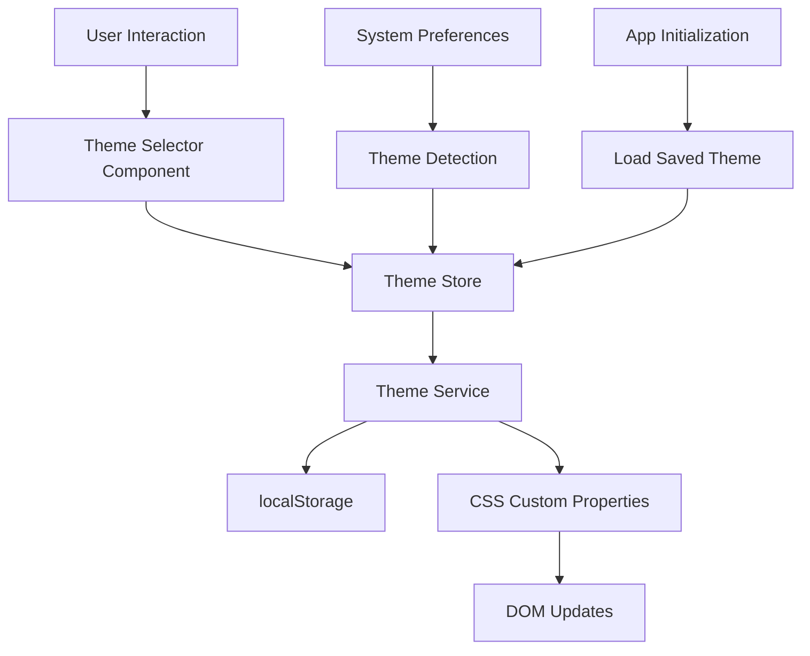

# Theme Mode Design Document

## Overview

The theme system will provide a flexible, scalable solution for managing visual themes in the SvelteKit invoicer application. It will support standard light/dark modes, seasonal themes like Christmas, and provide a foundation for future theme additions. The system will use CSS custom properties, Svelte stores for state management, and localStorage for persistence.

## Architecture

### Core Components

1. **Theme Store** - Svelte store managing current theme state
2. **Theme Service** - Business logic for theme operations and persistence
3. **Theme Selector Component** - UI component for theme selection
4. **CSS Theme Definitions** - Theme-specific CSS custom property definitions
5. **Theme Detection Utility** - System preference detection

### Data Flow



## Components and Interfaces

### Theme Store Interface

```typescript
interface ThemeStore {
	current: Readable<Theme>;
	setTheme: (theme: Theme) => void;
	toggleTheme: () => void;
	initializeTheme: () => void;
}

interface Theme {
	id: string;
	name: string;
	type: 'light' | 'dark' | 'seasonal';
	cssClass: string;
	description?: string;
}
```

### Available Themes

```typescript
const THEMES: Theme[] = [
	{
		id: 'light',
		name: 'Light',
		type: 'light',
		cssClass: 'theme-light',
		description: 'Clean light theme for daytime use'
	},
	{
		id: 'dark',
		name: 'Dark',
		type: 'dark',
		cssClass: 'theme-dark',
		description: 'Easy on the eyes for low-light environments'
	},
	{
		id: 'christmas',
		name: 'Christmas',
		type: 'seasonal',
		cssClass: 'theme-christmas',
		description: 'Festive holiday theme with warm colors'
	}
];
```

### Theme Service

```typescript
class ThemeService {
	private static readonly STORAGE_KEY = 'invoicer-theme';

	static saveTheme(theme: Theme): void;
	static loadTheme(): Theme | null;
	static detectSystemTheme(): 'light' | 'dark';
	static applyTheme(theme: Theme): void;
	static getDefaultTheme(): Theme;
}
```

### Theme Selector Component

The theme selector will be a dropdown/modal component that:

- Displays all available themes with preview indicators
- Shows the currently active theme
- Provides smooth transitions between themes
- Includes theme descriptions for better UX

## Data Models

### Theme Configuration

Each theme will define CSS custom properties that override the base design system:

```css
/* Base theme variables (current system) */
:root {
	--fg: var(--900);
	--fg-1: var(--800);
	--fg-2: var(--700);
	--bg: var(--100);
	--bg-1: var(--300);
	--bg-2: var(--400);
	--sheet: var(--100);
	--blue: #094ccf;
	/* ... existing variables */
}

/* Dark theme overrides */
.theme-dark {
	--fg: var(--100);
	--fg-1: var(--200);
	--fg-2: var(--300);
	--bg: var(--900);
	--bg-1: var(--800);
	--bg-2: var(--700);
	--sheet: var(--800);
	--blue: #4a9eff;
}

/* Christmas theme overrides */
.theme-christmas {
	--fg: #2d5016;
	--fg-1: #4a7c59;
	--fg-2: #6b8e23;
	--bg: #f0f8f0;
	--bg-1: #e6f3e6;
	--bg-2: #d4e6d4;
	--sheet: #ffffff;
	--blue: #c41e3a;
	--accent-red: #c41e3a;
	--accent-green: #228b22;
	--accent-gold: #ffd700;
}
```

### Storage Schema

```typescript
interface ThemePreference {
	themeId: string;
	timestamp: number;
	version: string; // For future migration support
}
```

## Error Handling

### Theme Loading Failures

1. **Invalid stored theme**: Fall back to system preference or light theme
2. **CSS loading errors**: Graceful degradation to base styles
3. **localStorage unavailable**: Use session-only theme persistence

### System Preference Detection

1. **No matchMedia support**: Default to light theme
2. **Permission denied**: Use light theme as fallback
3. **Preference change errors**: Log error but continue with current theme

### Theme Application Failures

1. **CSS class application fails**: Retry once, then fall back to default
2. **Custom property updates fail**: Use inline styles as backup
3. **Component re-render issues**: Force re-mount if necessary

## Testing Strategy

### Unit Tests

1. **Theme Store Tests**

   - Theme switching functionality
   - State persistence and restoration
   - Default theme selection logic

2. **Theme Service Tests**

   - localStorage operations
   - System preference detection
   - CSS class application
   - Error handling scenarios

3. **Theme Selector Component Tests**
   - User interaction handling
   - Theme preview functionality
   - Accessibility compliance

### Integration Tests

1. **End-to-End Theme Switching**

   - Complete user workflow from selection to application
   - Cross-component theme consistency
   - Persistence across browser sessions

2. **System Integration**
   - System preference detection and following
   - Theme override behavior
   - Browser compatibility testing

### Visual Regression Tests

1. **Theme Consistency**

   - Screenshot comparisons for each theme
   - Component rendering verification
   - Print styles compatibility

2. **Accessibility Testing**
   - Color contrast validation for all themes
   - Focus indicator visibility
   - Screen reader compatibility

## Implementation Considerations

### Performance

- CSS custom properties provide efficient theme switching
- Minimal JavaScript execution for theme changes
- Lazy loading of seasonal theme assets if needed

### Accessibility

- Maintain WCAG AA contrast ratios for all themes
- Respect user's reduced motion preferences
- Provide clear visual feedback for theme changes
- Ensure keyboard navigation support

### Browser Compatibility

- CSS custom properties (IE11+ support not required based on modern SvelteKit)
- localStorage availability checks
- matchMedia API for system preference detection

### Scalability

- Theme definition structure supports easy additions
- CSS architecture allows for theme inheritance
- Component-based approach enables theme-aware components

### Migration Strategy

- Existing CSS variables remain unchanged for backward compatibility
- New theme system layers on top of current design system
- Gradual rollout possible with feature flags if needed
