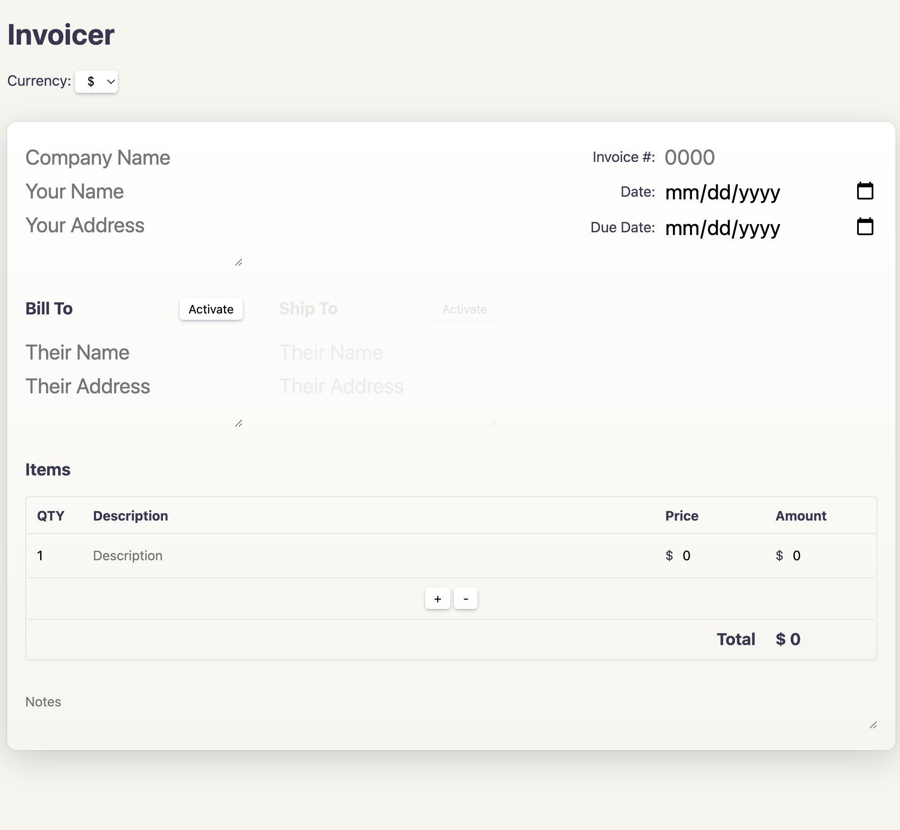

# Invoicer

https://invoice.tolin.ski

I needed to make an invoice, so I made this as another practical Svelte 5 example.

Oh it's also completely local. Stores invoices locally and allows you to download all data to JSON if you'd like to export and save offline.

It was made quickly, so don't worry about the state of the css, It’s like, they’re not even real styles. They're just, like, not important, like, they don't matter. Like, there's, like, no records of 'em. No, they're just, like, nothing. Like, they're not even supposed to be around in the area. Bottom line is, no one's gonna get in trouble, nobody should feel sad at all. The cops were just like, "Oh, yeah, this is fine. Don't worry about it at all."
